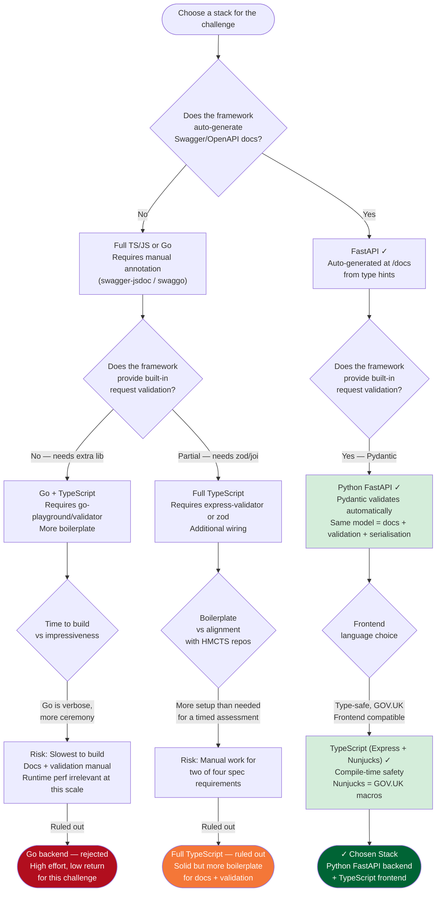
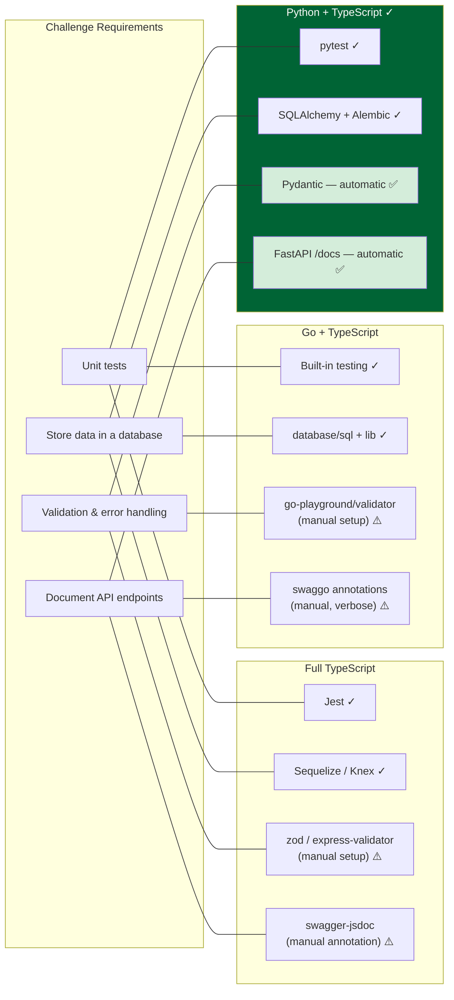
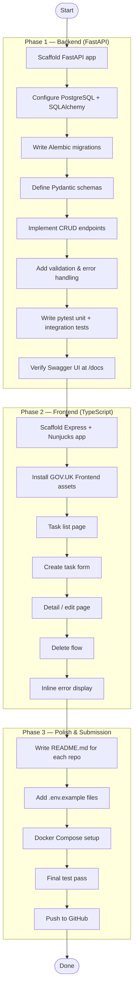
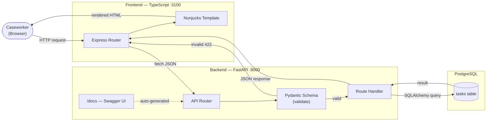
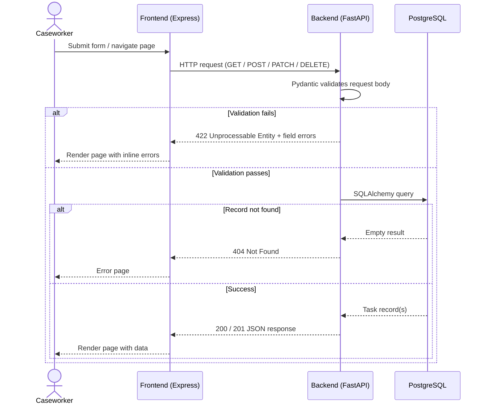
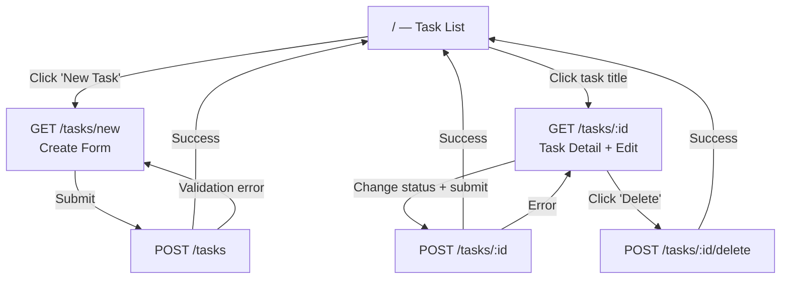
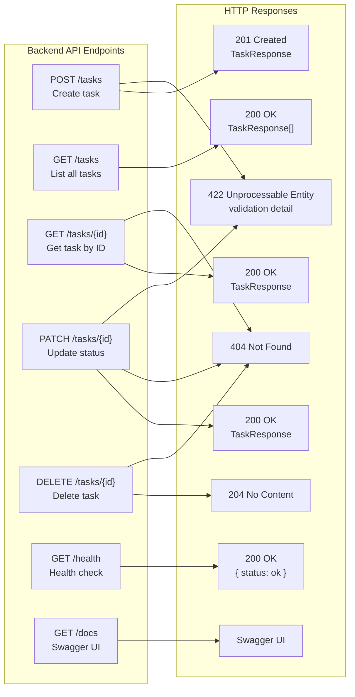
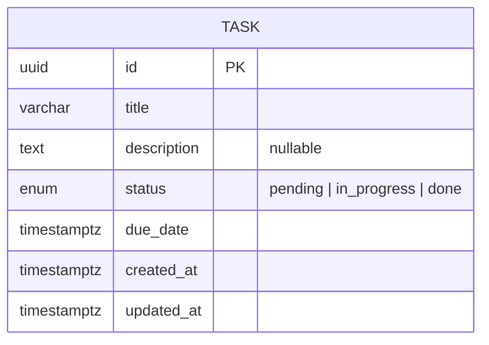
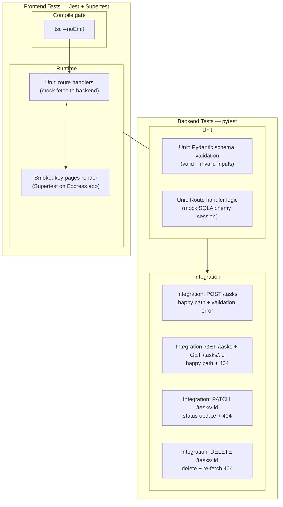

# WORKFLOW.md — HMCTS Task Manager

## 1. Stack Decision Flow

---

## 2. Stack Requirements Coverage

---

## 3. Development Phases

---

## 4. System Architecture Flow

---

## 5. API Request Lifecycle

---

## 6. Frontend User Journey

---

## 7. CRUD Endpoint Map

---

## 8. Data Model

---

## 9. Testing Strategy

